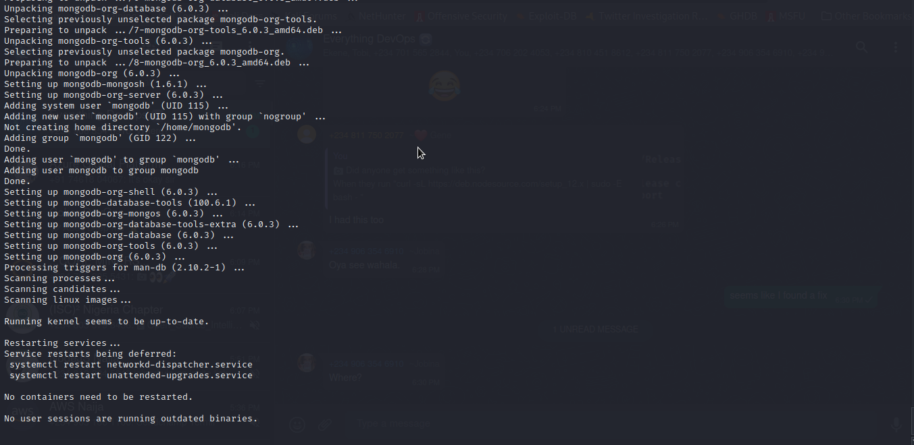

# MEAN-Stack-Web-Book-Register-App-on-AWS
This Repository explains the steps involved in creating and deploying a simple Web Book Register App on MEAN stack in AWS

-----
______

Below is the Architectural diagram of what our deployment will look like.

_____
----
### Step 0: Create a Virtual Server on AWS
<!-- UL -->
* Login to the AWS console
* Search for EC2 (Elastic Compute Cloud) 
* Select your preferred region (the closest to you) and launch a new EC2 instance of t2.micro family with Ubuntu Server 20.04 LTS (HVM)
* Type a name e.g My_Lamp_Server
 Click create a new key pair, use any name of your choice as the name for the pem file and select .pem.
    * Linux/Mac users, choose .pem for use with openssh. This allows you to connect to your server using open ssh clients.
    * For windows users choose .ppk for use with putty. Putty is a software that lets you connect remotely to servers
* Save your private key (.pem file) securely and do not share it with anyone! If you lose it, you will not be able to connect to your server ever again! 

 
* On your local computer, open the terminal and change directory to the Downloads folder, type 
    > `cd ~/Downloads `
* Change permissions for the private key file (.pem), otherwise you can get an error “Bad permission”
    > `sudo chmod 0400 <private-key-name>`. pem 
* Connect to the instance by running
    > `ssh -i <private-key-name>. pem ubuntu@<Public-IP-address>`
    
## Step 1: Install NodeJs
Node.js is a JavaScript runtime built on Chrome’s V8 JavaScript engine. Node.js is used in this tutorial to set up the Express routes and AngularJS controllers.

* Update EC2 instance, that is Ubuntu

    `sudo apt update`

    

* Upgrade ubuntu

    `sudo apt upgrade`

* Add certificates
        
        sudo apt -y install curl dirmngr apt-transport-https lsb-release ca-certificates
 
        curl -sL https://deb.nodesource.com/setup_12.x | sudo -E bash -

    

    

* Install NodeJS
    `sudo apt install -y nodejs`

    

## Step 2: Install MongoDB
MongoDB stores data in adaptable documents that resemble JSON.
A database's fields can change from one document to another, and the data structure itself can change over time.

        sudo apt-key adv --keyserver hkp://keyserver.ubuntu.com:80 --recv 0C49F3730359A14518585931BC711F9BA15703C6
        
        echo "deb [ arch=amd64 ] https://repo.mongodb.org/apt/ubuntu trusty/mongodb-org/3.4 multiverse" | sudo tee /etc/apt/sources.list.d/mongodb-org-3.4.list

* Install MongoDB

    `sudo apt install -y mongodb`

    * If the above throws an error, try running the below commnad with "jammy" replacing "trusty" depending on your version of ubuntu.

            echo "deb [ arch=amd64 ] https://repo.mongodb.org/apt/ubuntu jammy/mongodb-org/3.4 multiverse" | sudo tee /etc/apt/sources.list.d/mongodb-org-3.4.list
    
    
   
    * then install gnupg

    `sudo apt-get install -y gnupg`

    
    
    * then update the server again

    `sudo apt-get update`

    

    * Now try installing mongodb 

    `sudo apt-get install -y mongodb-org`
    
    

* Start The server

  `sudo service mongod start` 

* Verify that the service is up and running

    `sudo systemctl status mongod`
    

    You may get an error that the service status is failed as shown above.

    * then use the command below to check the logs for the error

         `journalctl -u mongod`

         

    * Run the following commands to ensure that the service account mongo has exclusive permission to /var/lib/mongodb 

            sudo chown -R mongodb:mongodb /var/lib/mongodb
            sudo chown -R mongodb:mongodb /var/log/mongodb
            sudo chown mongodb:mongodb /tmp/mongodb-27017.sock

         

    * then start the mongodb service again and check the status.

    

* Install npm – Node package manager.

    `sudo apt install -y npm`

    

