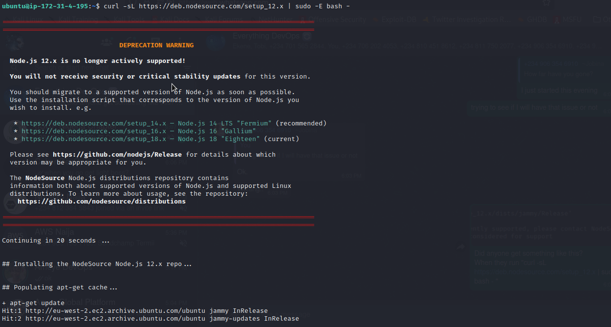

# MEAN-Stack-Web-Book-Register-App-on-AWS
This Repository explains the steps involved in creating and deploying a simple Web Book Register App on MEAN stack in AWS

## Step 1: Install NodeJs
Node.js is a JavaScript runtime built on Chrome’s V8 JavaScript engine. Node.js is used in this tutorial to set up the Express routes and AngularJS controllers.

* Update EC2 instance, that is Ubuntu

    `sudo apt update`

    

* Upgrade ubuntu

    `sudo apt upgrade`

* Add certificates
        
        sudo apt -y install curl dirmngr apt-transport-https lsb-release ca-certificates
 
        curl -sL https://deb.nodesource.com/setup_12.x | sudo -E bash -

    

    

* Install NodeJS
    `sudo apt install -y nodejs`

    
