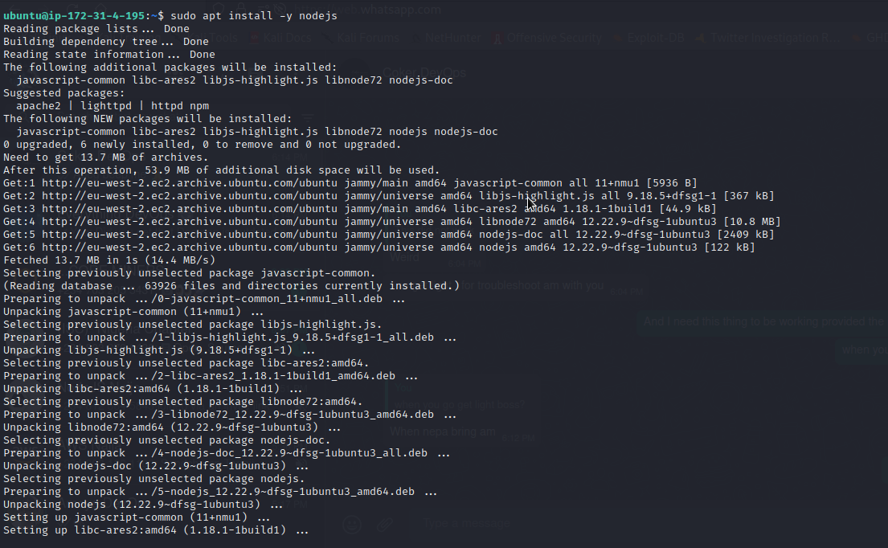

# MEAN-Stack-Web-Book-Register-App-on-AWS
This Repository explains the steps involved in creating and deploying a simple Web Book Register App on MEAN stack in AWS

-----
______

Below is the Architectural diagram of what our deployment will look like.

_____
----
### Step 0: Create a Virtual Server on AWS
<!-- UL -->
* Login to the AWS console
* Search for EC2 (Elastic Compute Cloud) 
* Select your preferred region (the closest to you) and launch a new EC2 instance of t2.micro family with Ubuntu Server 20.04 LTS (HVM)
* Type a name e.g Mean_Stack_Server.

* Click create a new key pair, use any name of your choice as the name for the pem file and select .pem.
* Linux/Mac users, choose .pem for use with openssh. This allows you to connect to your server using ssh.
* For windows users choose .ppk for use with putty. Putty is a software that lets you connect remotely to servers
* Save your private key (.pem file) securely and do not share it with anyone! If you lose it, you will not be able to connect to your server ever again! 

 
* On your local computer, open the terminal and change directory to the Downloads folder, type 
    > `cd ~/Downloads `
* Change permissions for the private key file (.pem), otherwise you can get an error “Bad permission”
    > `sudo chmod 0400 <private-key-name>`. pem 
* Connect to the instance by running
    > `ssh -i <private-key-name>. pem ubuntu@<Public-IP-address>`
    
------
______
## Step 1: Install NodeJs
Node.js is an open-source server environment. It is cross-platform and runs on Windows, Linux, Unix, and macOS. Node.js is a back-end JavaScript runtime environment. Node.js will be used to set up the Express routes and AngularJS controllers.

* Update EC2 instance, that is Ubuntu

    `sudo apt update`

    

* Upgrade ubuntu

    `sudo apt upgrade`

* Add certificates
        
        sudo apt -y install curl dirmngr apt-transport-https lsb-release ca-certificates
 
        curl -sL https://deb.nodesource.com/setup_12.x | sudo -E bash -

    

    

* Install NodeJS
    `sudo apt install -y nodejs`

    

-------
_______
## Step 2: Install MongoDB
MongoDB stores data in adaptable documents that resemble JSON.
A database's fields can change from one document to another, and the data structure itself can change over time.

        sudo apt-key adv --keyserver hkp://keyserver.ubuntu.com:80 --recv 0C49F3730359A14518585931BC711F9BA15703C6
        
        echo "deb [ arch=amd64 ] https://repo.mongodb.org/apt/ubuntu trusty/mongodb-org/3.4 multiverse" | sudo tee /etc/apt/sources.list.d/mongodb-org-3.4.list

* Install MongoDB

    `sudo apt install -y mongodb`

    * If the above throws an error, try running the below commnad with "jammy" replacing "trusty" depending on your version of ubuntu.

            echo "deb [ arch=amd64 ] https://repo.mongodb.org/apt/ubuntu jammy/mongodb-org/3.4 multiverse" | sudo tee /etc/apt/sources.list.d/mongodb-org-3.4.list
    
    
   
    * then install gnupg

    `sudo apt-get install -y gnupg`

    
    
    * then update the server again

    `sudo apt-get update`

    

    * Now try installing mongodb 

    `sudo apt-get install -y mongodb-org`

    
    

* Start The server

  `sudo service mongod start` 

* Verify that the service is up and running

    `sudo systemctl status mongod`
    

    You may get an error that the service status is failed as shown above.

    * then use the command below to check the logs for the error

         `journalctl -u mongod`

         

    * Run the following commands to ensure that the service account mongodb has exclusive permission to /var/lib/mongodb 

            sudo chown -R mongodb:mongodb /var/lib/mongodb
            sudo chown -R mongodb:mongodb /var/log/mongodb
            sudo chown mongodb:mongodb /tmp/mongodb-27017.sock

         

    * then start the mongodb service again and check the status.

    

* Now, Install npm – Node package manager.

    `sudo apt install -y npm`

    

* Install body-parser package

We need ‘body-parser’ package to help us process JSON files passed in requests to the server.

`sudo npm install body-parser`

* Create a folder named ‘Books’ and change directory to that folder

`mkdir Books && cd Books`

* In the Books directory, Initialize npm project

    `npm init`

    

* Add a file to it named server.js

    `vi server.js`

* Copy and paste the web server code below into the server.js file.

        var express = require('express');
        var bodyParser = require('body-parser');
        var app = express();
        app.use(express.static(__dirname + '/public'));
        app.use(bodyParser.json());
        require('./apps/routes')(app);
        app.set('port', 3300);
        app.listen(app.get('port'), function() {
        console.log('Server up: http://localhost:' + app.get('port'));
            });

---------
_________
## Step 3: Install Express and set up routes to the server
The Express web application framework for Node.js offers features for both online and mobile applications. Express will be used to transfer book data to and from our MongoDB database.
We'll also make use of the Mongoose package, which offers a simple, schema-based way to model the data for your application. We will create a database schema using Mongoose to hold the data from our book register.

`sudo npm install express mongoose`

* In ‘Books’ directory, create a folder named apps and cd into it.

    `mkdir apps && cd apps`
    
    

* Create a file named routes.js

    `vi routes.js`

    Copy and paste the code below into routes.js

        var Book = require('./models/book');
        module.exports = function(app) {
        app.get('/book', function(req, res) {
            Book.find({}, function(err, result) {
            if ( err ) throw err;
            res.json(result);
            });
        }); 
        app.post('/book', function(req, res) {
            var book = new Book( {
            name:req.body.name,
            isbn:req.body.isbn,
            author:req.body.author,
            pages:req.body.pages
            });
            book.save(function(err, result) {
            if ( err ) throw err;
            res.json( {
                message:"Successfully added book",
                book:result
            });
            });
        });
        app.delete("/book/:isbn", function(req, res) {
            Book.findOneAndRemove(req.query, function(err, result) {
            if ( err ) throw err;
            res.json( {
                message: "Successfully deleted the book",
                book: result
            });
            });
        });
        var path = require('path');
        app.get('*', function(req, res) {
            res.sendfile(path.join(__dirname + '/public', 'index.html'));
        });
        };

    

* In the ‘apps’ directory, create a folder named models and cd into it.

    `mkdir models && cd models`

    

    * Create a file named book.js

        `vi book.js`

        Copy and paste the code below into ‘book.js’

            var mongoose = require('mongoose');
            var dbHost = 'mongodb://localhost:27017/test';
            mongoose.connect(dbHost);
            mongoose.connection;
            mongoose.set('debug', true);
            var bookSchema = mongoose.Schema( {
            name: String,
            isbn: {type: String, index: true},
            author: String,
            pages: Number
            });
            var Book = mongoose.model('Book', bookSchema);
            module.exports = mongoose.model('Book', bookSchema);

----------
__________
## Step 4 – Access the routes with AngularJS
With the help of AngularJS, you can build dynamic views for your web applications.

* Change the directory back to ‘Books’

    `cd ../..`

* Create a folder named public and cd into it

    

  `mkdir public && cd public`
* Add a file named script.js
    `vi script.js`

    

* Copy and paste the Code below (controller configuration defined) into the script.js file.

        var app = angular.module('myApp', []);
        app.controller('myCtrl', function($scope, $http) {
        $http( {
            method: 'GET',
            url: '/book'
        }).then(function successCallback(response) {
            $scope.books = response.data;
        }, function errorCallback(response) {
            console.log('Error: ' + response);
        });
        $scope.del_book = function(book) {
            $http( {
            method: 'DELETE',
            url: '/book/:isbn',
            params: {'isbn': book.isbn}
            }).then(function successCallback(response) {
            console.log(response);
            }, function errorCallback(response) {
            console.log('Error: ' + response);
            });
        };
        $scope.add_book = function() {
            var body = '{ "name": "' + $scope.Name + 
            '", "isbn": "' + $scope.Isbn +
            '", "author": "' + $scope.Author + 
            '", "pages": "' + $scope.Pages + '" }';
            $http({
            method: 'POST',
            url: '/book',
            data: body
            }).then(function successCallback(response) {
            console.log(response);
            }, function errorCallback(response) {
            console.log('Error: ' + response);
            });
        };
        });

* In the public folder, create a file named index.html;

  `vi index.html`

    

  * Copy and paste the code below into index.html file.

            <!doctype html>
        <html ng-app="myApp" ng-controller="myCtrl">
        <head>
            
            
        </head>
        <body>
            

            <table>
                <tr>
                <td>Name:</td>
                <td><input type="text" ng-model="Name"></td>
                </tr>
                <tr>
                <td>Isbn:</td>
                <td><input type="text" ng-model="Isbn"></td>
                </tr>
                <tr>
                <td>Author:</td>
                <td><input type="text" ng-model="Author"></td>
                </tr>
                <tr>
                <td>Pages:</td>
                <td><input type="number" ng-model="Pages"></td>
                </tr>
            </table>
            <button ng-click="add_book()">Add</button>
            

            

            

            <table>
                <tr>
                <th>Name</th>
                <th>Isbn</th>
                <th>Author</th>
                <th>Pages</th>
        
                </tr>
                <tr ng-repeat="book in books">
                <td>{{book.name}}</td>
                <td>{{book.isbn}}</td>
                <td>{{book.author}}</td>
                <td>{{book.pages}}</td>
        
                <td><input type="button" value="Delete" data-ng-click="del_book(book)"></td>
                </tr>
            </table>
            

        </body>
        </html>

* Change the directory back to Books directory

    `cd ..`

* Start the server by running this command:

    `node server.js`

* The server is now up and running, we can connect it via port 3300. You can launch a separate Putty or SSH console to test what the curl command returns locally.

    `curl -s http://localhost:3300`

* It shall return an HTML page, it is hardly readable in the CLI, but we can also try and access it from the Internet.
For this – you need to open TCP port 3300 in your AWS Web Console for your EC2 Instance.

* You can view the app on your web browser 
    `http://(public-ip):3300`

    

* You can make the app look more nice by adding a styles.css file in the public directory and inserting some css code similar to the one below.

     body {
     background-color: #F82C84;
     }
     h1 {
     color: powderblue;
     }
     
* Also you can add a header in the index.html file to denote what your app is.

* Change directory to 'Books' folder

    `cd ..`

* Now run the server 

    `node server.js`

    

* View the app on your web browser 

    `http://(public-ip):3300`

_______
-------
### !!! Congratulations you have succesfully created a Web book register app using the MEAN (Mongodb, Express, Angular and Node) stack tools
